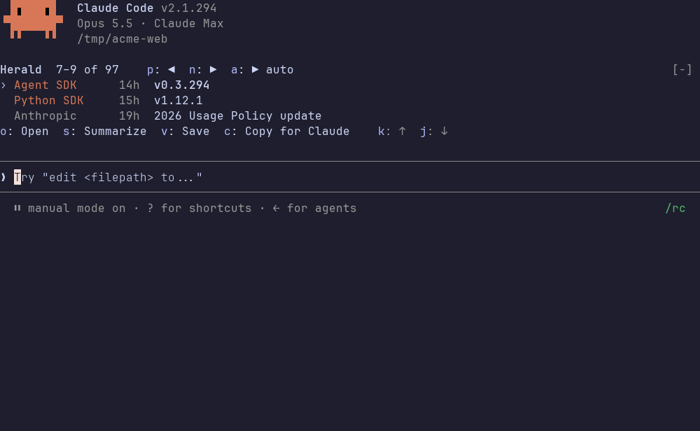
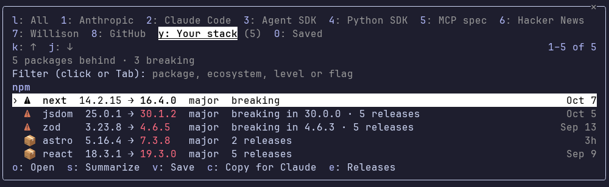

# Herald

**News and releases for your stack, right above the prompt.**

 [](LICENSE)

Herald is a Claude Code mod, a plugin that draws its own interface inside Claude Code. It keeps you up to date on Claude, the tools around it and the packages your project depends on, without leaving the terminal. A band above the prompt rotates the latest headlines and flags the releases of your dependencies that are breaking or security fixes.


## Install

You need Claude Code 2.1.287 or later. Run these in your shell:

```bash
claude plugin marketplace add dieg666/claude-herald
claude plugin install herald@claude-herald
```

If a session is open, run `/reload-plugins` in it. Then run `/herald` to open the pane. The band appears once the first refresh has fetched items, and releases of your dependencies join it once Herald has read their feeds.

To try Herald for one session without installing it, or to update or uninstall it, see [How-to guides](docs/how-to.md).

## What you get

### A band above the prompt

The band shows three items a page and turns the page every 20 seconds. It mixes every enabled source so that a busy one cannot fill a page, and it puts the newest flagged releases of your stack first. Each row shows the source, the item's age and a headline that links to the item. Items you have opened or copied leave the band.

| Key      | What it does                                                         |
| -------- | -------------------------------------------------------------------- |
| `p`, `n` | Shows the previous or next page.                                     |
| `a`      | Pauses or resumes the rotation.                                      |
| `k`, `j` | Selects the item above or below.                                     |
| `o`      | Opens the item in your browser.                                      |
| `s`      | Writes a 3 to 5 line Haiku summary under the item in the transcript. |
| `v`      | Saves the item for later.                                            |
| `c`      | Copies the item for Claude, as a prompt to paste.                    |

Hotkeys work while the band or the pane has the keyboard: press ctrl+x tab or click it (see [Keyboard focus](docs/band-and-pane.md#keyboard-focus)). On a narrow terminal the band turns compact and shows one headline a page.

### A pane for every source

`/herald` opens a pane with an All tab, a tab per source with a count of new items, a Your stack tab and a Saved tab.



All lists the band's items in the band's order and keeps the ones you have read, dim. Press `l` for All, `1` to `9` for the source tabs, `y` for Your stack and `0` for Saved.

### Release tracking for your stack

Herald reads your project's package manifests and lockfiles, finds each package's GitHub repository through its registry and follows its releases. It compares each release with the version you use and marks it `⚠` when it is flagged breaking or security, by keywords and by Haiku reading the release notes.



It reads npm, Python, Go, Rust, Ruby, PHP, .NET, Java, Swift and Dart projects. By default the band and the pane show minor, major and flagged releases, and only breaking and security releases raise a toast ([Show and toast levels](docs/your-stack.md#show-and-toast-levels)). Run `/herald deps` to see which packages it follows, and `/herald deps ignore <package>` to stop following one. For the rest, see [Your stack](docs/your-stack.md).

### Sources to start with

Herald starts with ten sources, nine of them on: Anthropic news, the release feeds of Claude Code, the Claude Agent SDK (TS), the Anthropic Python SDK and the MCP spec, Hacker News, Simon Willison, AINews (smol.ai) and the GitHub changelog. The tenth, Claude status, is off. You can turn any of them on or off and add your own RSS or Atom feeds and web pages.

## Privacy at a glance

Herald asks Claude Code only for what its features need:

- **It never reads your prompts, your conversation or what Claude does in your session.**
- **It reads only package manifests and lockfiles from your project's files**, such as `package.json` and `uv.lock`. [Files stack detection reads](docs/security.md#files-stack-detection-reads) has the full list.
- **It sends package names to the package registries, GitHub and a few Go import hosts to find releases** ([Network hosts](docs/security.md#network-hosts)). For NuGet and Maven it also sends the version you use. To stop that for a project, turn Your stack off with `/herald deps off`.
- **It fetches the news sources you have on**, and the addresses you add yourself.
- **It uses a little Haiku through your own Claude Code session**, to check releases and to read web-page sources. Automatic summaries are off.
- **It has no telemetry.** Nothing goes to the author.
- **Its data stays on your machine**, in a JSON file in Claude Code's plugin store. To delete it, see [Delete stored data](docs/how-to.md#delete-stored-data).
- **Feed text is treated as untrusted.** Copy for Claude puts text on your clipboard but never submits a prompt.

For the exact calls, hosts, files and accepted risks, see [Security and privacy details](docs/security.md).

## What Herald sends, runs and hooks

**What it sends and where.** Fetch requests go to the news sources you have on: `www.anthropic.com`, `github.com` (Claude Code, Claude Agent SDK, Anthropic Python SDK and MCP spec releases), `hnrss.org` (with `news.ycombinator.com` as a fallback), `simonwillison.net`, `news.smol.ai` and `github.blog`, plus `status.claude.com` if you turn Claude status on, and any feed or page address you add. While Your stack is on, package names go in the URL path to the registries of the ecosystems your project uses (`registry.npmjs.org`, `pypi.org`, `crates.io`, `proxy.golang.org` and a few Go import hosts, `rubygems.org`, `repo.packagist.org`, `api.nuget.org`, `repo1.maven.org`), and repository paths go to `github.com` for their `releases.atom` or `tags.atom` feed. Item and release text goes to Haiku through your own Claude Code session. Nothing else leaves your machine. [Network hosts](docs/security.md#network-hosts) has every host and when it is contacted.

**What it runs and why.** It runs only fixed programs, each with an argument vector and no shell of its own, to open a link in your browser and to copy text for Claude:

- `uname -s`, to tell macOS from other systems.
- `open` (macOS), `rundll32 url.dll,FileProtocolHandler` (Windows) or `xdg-open` (elsewhere, started through `sh -c` with the address as `$1`), to open an http or https link.
- `pbcopy` (macOS), `powershell` and `clip.exe` (Windows), or `wl-copy` and `xclip` (elsewhere), to put text on the clipboard. The text goes to the program's standard input.

[Commands the mod runs](docs/security.md#commands-the-mod-runs) has each exact command.

**What it reads from your machine.** Package manifests and lockfiles in your project, the environment values `HOME` and `USERPROFILE` (to stop the project search at your home directory) and `OS` (to tell Windows apart), and Claude Code's `language` setting (for the language of summaries). It asks for no secrets.

**What each hook does.** It has no hook on prompts, tool calls or the transcript.

- `session.start` loads its stored data, starts the refresh and rotation timers and registers `/herald`.
- `command.run` for `herald` answers `/herald` and its subcommands.
- `ui.render` above the prompt draws the band; it adds the band to what other mods draw there and changes nothing else.
- `ui.render` for the `herald` pane draws the pane.
- `ui.open` and `ui.close` for the `herald` pane redraw the band, which steps aside while the pane shows; they change nothing in the pane itself.
- `SessionStart` on clear, resume or fork reloads the stored data and registers `/herald` again, because those reset the mod's state.

## First commands

| Command                           | What it does                                                                                                       |
| --------------------------------- | ------------------------------------------------------------------------------------------------------------------ |
| `/herald`                         | Opens the pane.                                                                                                    |
| `/herald deps`                    | Shows which packages Herald follows for this project and where each one's releases come from.                      |
| `/herald deps ignore <package>`   | Stops following one package, such as `npm:left-pad`.                                                               |
| `/herald deps toast off`          | Stops release toasts.                                                                                              |
| `/herald deps off`                | Stops following this project's dependencies and leaves the other sources alone.                                    |
| `/herald disable Hacker News`     | Turns a source off. `/herald list` shows the names.                                                                |
| `/herald add <url> [name]`        | Follows an RSS or Atom feed. `/herald add-page` follows a web page.                                                |
| `/herald interval <minutes>`      | Sets the minutes between refreshes, 5 by default.                                                                  |
| `/herald rotate <seconds>`        | Sets the seconds between band pages, 20 by default.                                                                |
| `/herald lang <feed\|user\|code>` | Sets the language of summaries, such as `es`.                                                                      |
| `/herald summaries on`            | Writes a one-line Haiku summary under each headline. Off by default; `s` summarizes one item on demand either way. |

For every command and setting, see the [Reference](docs/reference.md#commands).

## FAQ

**Does Herald send my code anywhere?** No. It reads only package manifests and lockfiles from your project's files, and it sends package names to find their releases. To stop that for a project, run `/herald deps off`.

**What does it cost?** With automatic summaries off, Herald makes a few small Haiku calls per refresh, with a cap: it checks new releases of your stack and reads a page source's headlines when the page changes. Every answer is cached. The calls count against your plan or are billed to your API key. For the caps, see [Haiku calls and cost](docs/reference.md#haiku-calls-and-cost).

**Why does a release not show up?** It might be at or below your version, an unflagged patch release (hidden by default), a pre-release, or waiting for its lookup. For the checks, see [Fix common problems](docs/how-to.md#fix-common-problems).

**How do I remove Herald and its data?** See [Uninstall](docs/how-to.md#uninstall) and [Delete stored data](docs/how-to.md#delete-stored-data).

**Why is the plugin `herald` and the marketplace `claude-herald`?** `claude plugin validate` refuses plugin names that start with `claude-`. For other design choices, see [Design decisions and deviations](docs/design.md).

## Documentation

- [How-to guides](docs/how-to.md): install, update and uninstall, delete stored data, reduce Haiku calls and fix common problems.
- [Band and pane](docs/band-and-pane.md): what the band and the pane draw, their keys and the item actions.
- [Your stack](docs/your-stack.md): which packages Herald follows, how it finds and classifies releases, and the `/herald deps` subcommands.
- [Reference](docs/reference.md): terms, commands, sources, templates, summaries, Haiku calls, stored data and limitations.
- [Security and privacy details](docs/security.md): hooks, calls, hosts, files read, commands run, telemetry, untrusted content and accepted risks.
- [Privacy policy](docs/privacy.md): what Herald reads, sends and stores, in short.
- [Design decisions and deviations](docs/design.md): why Herald behaves as it does.
- [Development](docs/development.md): run the checks and change the mod. [README media](docs/media/README.md) says how the screenshots and recordings are made.

## Requirements

- Claude Code 2.1.287 or later. Tested with Claude Code 2.1.293.
- A terminal or the Desktop app to draw the band and the pane. In other places, such as `claude -p`, VS Code and cloud sessions, `/herald` answers with the latest items as text and `/herald deps` lists your stack as text.
- A session that can call a model. Page headlines, release checks and summaries use Haiku through your plan or API key. Herald asks for one-line summaries on its own only while automatic summaries are on; they are off by default.

## License

MIT, see [LICENSE](LICENSE).
